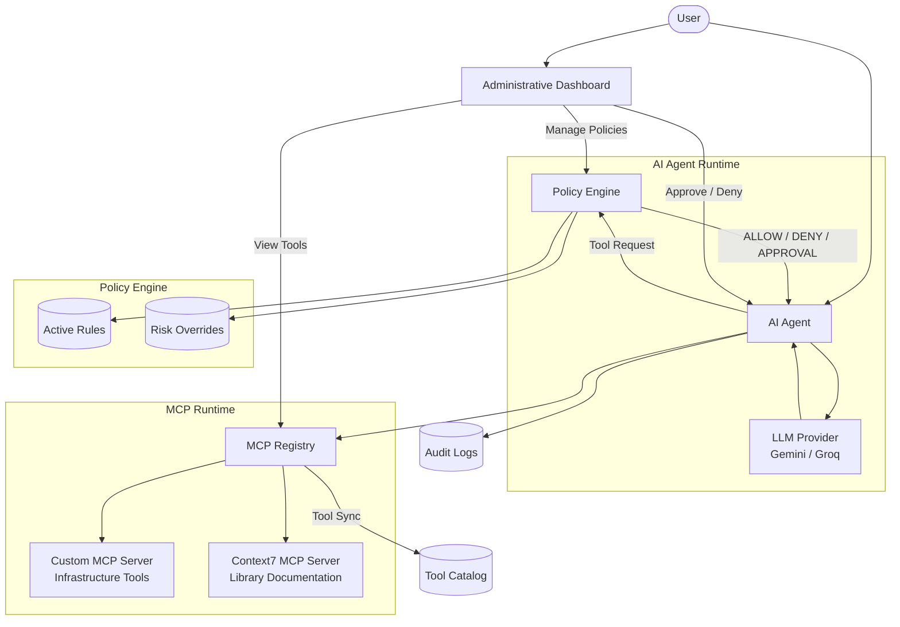

# Cossie

A guarded AI agent runtime that sits between LLMs and external tools, enforcing configurable authorization policies before every MCP tool invocation. Built as part of an SDE intern assessment.

[](https://github.com/dexisback/cossie/actions/workflows/ci.yml)
[](./LICENSE)

## Overview

Cossie is built around one idea: the model decides *what* it wants to do, independent infrastructure decides *whether it is allowed to*.

Instead of letting an LLM invoke tools directly, every tool request is evaluated by an isolated policy engine against administrator-defined runtime rules. Tools are discovered dynamically via the Model Context Protocol (MCP) from local and remote servers — no hardcoded tool definitions.

- **Dynamic tool discovery** — local infrastructure MCP server plus remote Context7 integration
- **Isolated policy engine** — block, require-approval, input validation, token budgets, and risk overrides, all updated at runtime
- **Human approval workflow** — high-risk actions pause until an admin approves or denies
- **Layered guardrails** — tiered prompt-injection handling (log → warn → block), output guard that redacts secrets and blocks identity disclosure, hard iteration cap on the tool loop
- **Admin dashboard** — policy management, live tool catalog, approval queue, conversation and injection logs, chat playground

## Architecture



Every request follows the same pipeline: the user submits a prompt, the LLM may request a tool, the policy engine returns `ALLOW`, `DENY`, or `REQUIRE_APPROVAL`, approved tools execute through the MCP registry, and every decision and execution is written to the audit log. Dashboard changes take effect on the running agent without a restart.

## Technology Stack

| Layer | Technology |
|--------|------------|
| Frontend | Next.js 16, React 19, Tailwind CSS v4, shadcn/ui |
| Backend | Express 5, TypeScript |
| AI Provider | Google Gemini (Groq fallback) |
| Protocol | Model Context Protocol (MCP) |
| Database / ORM | PostgreSQL (Neon), Prisma |
| Cache / Messaging | Redis (Upstash), Pub/Sub for runtime sync |
| Package Manager | pnpm Workspaces |
| Deployment | Vercel (dashboard) + Render (agent) |

## Repository Structure

```text
.
├── apps
│   ├── agent              # AI agent runtime
│   ├── dashboard          # Administrative dashboard
│   └── custom-mcp         # Infrastructure MCP server
├── packages
│   ├── db                 # Prisma client
│   ├── logger             # Shared logging utilities
│   ├── mcp-registry       # MCP discovery & execution
│   ├── policy-engine      # Runtime authorization engine
│   └── shared-types       # Shared interfaces & schemas
├── prisma
└── docs
```

Reusable runtime components live in independent workspace packages, keeping the policy engine, MCP registry, and shared contracts framework-agnostic.

## Getting Started

### Prerequisites

- Node.js 22+, pnpm 10+
- PostgreSQL (Neon works) and Redis (Upstash works)
- Google Gemini API key, Context7 API key

### Setup

```bash
git clone https://github.com/dexisback/cossie.git
cd cossie
cp .env.example .env    # fill in the values
pnpm install
pnpm build
pnpm dev
```

Dashboard: `http://localhost:3000` · Agent API: `http://localhost:4000`

### Docker

No local Node.js or database install required — Postgres/Redis stay external:

```bash
cp .env.example .env    # fill in the values
docker compose up --build
```

The agent container runs the Express API, spawns the custom MCP server over stdio, and the dashboard container proxies `/api/*` to it over the Docker network.

### Scripts

| Command | Purpose |
|---------|---------|
| `pnpm dev` | Run dashboard + agent in dev mode |
| `pnpm build` | Generate Prisma client, build all workspaces |
| `pnpm lint` | Lint across the workspace |
| `pnpm prisma:generate` | Generate Prisma client |
| `pnpm prisma:migrate` | Run database migrations |
| `pnpm seed` | Seed the database |

## Deployment

- **Backend** — Render (free tier). A scheduled GitHub Action (`.github/workflows/keep-alive.yml`) pings `/api/health` every 5 minutes to prevent cold starts; override the target with the `AGENT_URL` repo variable.
- **Frontend** — Vercel. Set `NEXT_PUBLIC_API_URL` to the Render URL and `CORS_ORIGIN` on the backend to the dashboard URL.

## Documentation

| Document | Description |
|----------|-------------|
| `docs/00.md` | Project philosophy, problem statement, monorepo architecture |
| `docs/01-backend-architecture.md` | Backend architecture, services, request lifecycle |
| `docs/02-api-reference.md` | REST API reference |
| `docs/03-policy-engine.md` | Policy evaluation pipeline, rule types, caching |
| `docs/04-security-model.md` | Trust boundaries, prompt injection handling |
| `docs/05-system-design.md` | Architectural decisions and tradeoffs |

## Roadmap

- Automatic execution continuation after approval
- WebSocket-based live dashboard updates
- Policy versioning, simulation, and rollback
- RBAC / ABAC and multi-stage approvals
- Additional remote MCP integrations

## License

Released under the [MIT License](./LICENSE).
